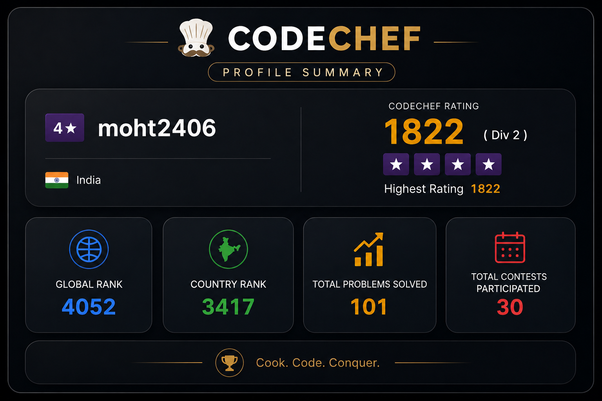

<h2 align="center"><b>Hello, I'm Mohit Thakur</b></h2>

  

  

  

---

<h2 align="center">About Me</h2>

Software Engineer focused on Distributed Systems, Deep Learning, and scalable Full-Stack applications. Experienced in MERN, Next.js, gRPC microservices, cloud deployments, and high-performance backend architectures. Passionate about system design, AI infrastructure, and advanced DSA problem solving.

---

<h2 align="center">
  
  Tech Stack
</h2>

<h3 align="center">Languages & Development</h3>

<table>
  <tr>
    <td align="center">
       Next.js
    </td>
    <td align="center">
       Tailwind
    </td>
    <td align="center">
       React
    </td>
    <td align="center">
       TypeScript
    </td>
    <td align="center">
       JavaScript
    </td>
    <td align="center">
       Redux
    </td>
    <td align="center">
       C++
    </td>
    <td align="center">
       Python
    </td>
  </tr>
</table>

 

<table>
  <tr>
    <td align="center">
       Node.js
    </td>
    <td align="center">
       Express
    </td>
    <td align="center">
       Java
    </td>
    <td align="center">
       gRPC
    </td>
    <td align="center">
       MySQL
    </td>
    <td align="center">
       MongoDB
    </td>
    <td align="center">
       Redis
    </td>
  </tr>
</table>

---

<h3 align="center">Cloud, DevOps & AI Tools</h3>

<table>
  <tr>
    <td align="center">
       Docker
    </td>
    <td align="center">
       Linux
    </td>
    <td align="center">
       Git
    </td>
    <td align="center">
       Vercel
    </td>
    <td align="center">
       Azure
    </td>
    <td align="center">
       GCP
    </td>
    <td align="center">
       AWS
    </td>
  </tr>
</table>

 

<table>
  <tr>
    <td align="center">
       ChatGPT
    </td>
    <td align="center">
       Claude
    </td>
    <td align="center">
       Gemini
    </td>
    <td align="center">
       Figma
    </td>
    <td align="center">
       NumPy
    </td>
    <td align="center">
       Pandas
    </td>
    <td align="center">
       Scikit
    </td>
  </tr>
</table>

---

<h2 align="center">GitHub Stats</h2>

  

  

<table>
  <tr>
    <td>
      
    </td>
    <td>
      
    </td>
  </tr>
</table>

 

---

<h2 align="center">Coding Profiles</h2>

| LeetCode | CodeChef | Codeforces | 
| :---: | :---: | :---: |
|  |  |  |

---

<h2 align="center">Let's Connect</h2>

 

⭐ From <a href="https://github.com/mohit12932">Mohit</a> — Let's innovate together!

